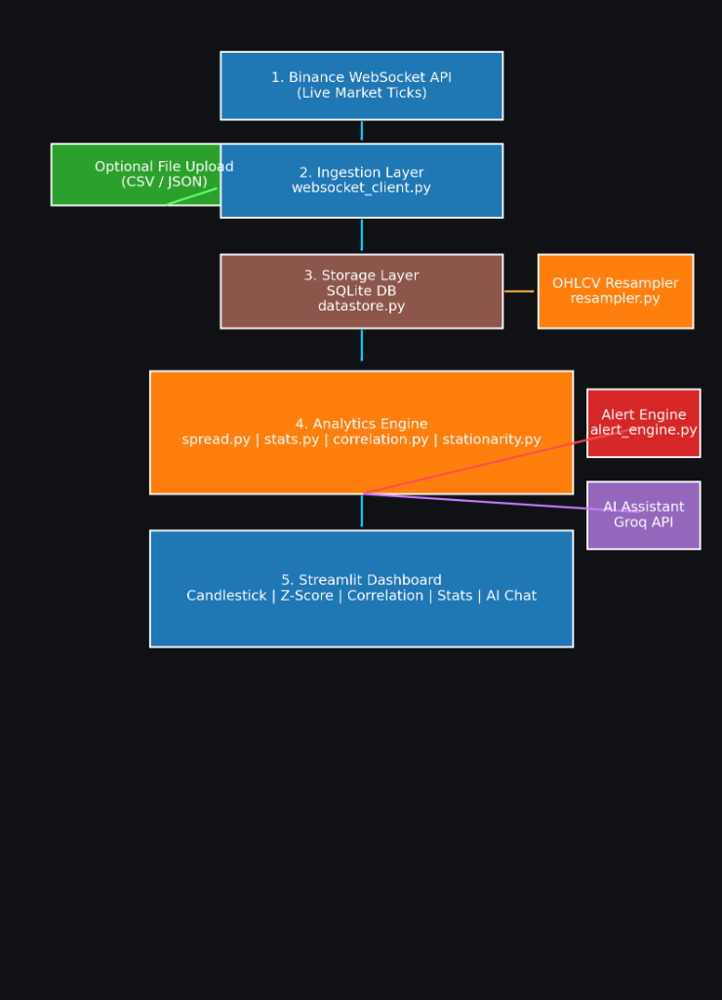

# Quant Analytics Dashboard

A professional real-time quantitative analytics dashboard for cryptocurrency pairs trading, featuring live market data ingestion, statistical analysis, and AI-powered insights.

## Features

- **Real-Time Data Ingestion**: Live tick data from Binance Futures WebSocket
- **OHLCV Resampling**: Convert tick data to candlestick charts (1s, 5s, 10s, 30s, 1min)
- **Statistical Analytics**:
  - Spread calculation with OLS hedge ratio
  - Z-score monitoring for mean reversion
  - Rolling correlation analysis
  - ADF stationarity testing
- **Smart Alerts**: Configurable threshold-based alerting system
- **AI Assistant**: Groq-powered market commentary and Q&A
- **Professional UI**: Dark theme with real-time charts and metrics

## Quick Start

### Prerequisites

- Python 3.9+
- Groq API Key (for AI features)

### Installation

```bash
# Clone the repository
cd quant_analytics_app

# Install dependencies
pip install -r requirements.txt

# Set up environment variables
cp .env.example .env
# Edit .env and add your GROQ_API_KEY
```

### Running the App

```bash
streamlit run app.py
```

The app will open in your browser at `http://localhost:8501`

## Usage

### Live Mode (Default)
1. Click "Start / Restart Feed" in the sidebar
2. Data begins streaming from Binance immediately
3. Charts and analytics update in real-time

### Upload Mode (Optional)
1. Select "Upload OHLC Data" in the sidebar
2. Upload a CSV/JSON file with OHLC data
3. Analyze historical data

### CSV Format for Upload
```csv
timestamp,open,high,low,close,volume
2025-01-01 00:00:00,50000,50100,49900,50050,100
```

## Analytics Methodology

### Spread Calculation
- Uses Ordinary Least Squares (OLS) regression to find optimal hedge ratio
- Spread = Price_A - hedge_ratio × Price_B
- Continuously updated as new data arrives

### Z-Score
- Measures standard deviations from mean
- Window-based calculation (default: 50 periods)
- Triggers alerts when crossing thresholds

### Correlation
- Rolling Pearson correlation
- Indicates co-movement strength
- Useful for pair selection validation

### Stationarity (ADF Test)
- Augmented Dickey-Fuller test
- Confirms mean-reverting properties
- Critical for pairs trading strategies

## Architecture



### System Overview

The application follows a layered architecture pattern with clear separation of concerns:

#### 1. Data Ingestion Layer (Blue)
**Binance WebSocket API** serves as the primary data source, streaming live market ticks in real-time. The **Ingestion Layer** (`websocket_client.py`) handles the WebSocket connection, normalizes incoming data, and manages connection reliability.

**Optional File Upload** (Green) provides an alternative data source for historical analysis, accepting CSV/JSON files with OHLC data.

#### 2. Storage Layer (Brown)
The **SQLite Database** (`datastore.py`) acts as the central data repository:
- Stores raw tick data with timestamps
- Persists OHLC candles at multiple timeframes
- Maintains alert history
- Provides efficient querying with proper indexing

#### 3. Resampling Layer (Orange - Side)
**OHLCV Resampler** (`resampler.py`) converts tick-level data into candlestick bars:
- Aggregates ticks into 1s, 5s, 10s, 30s, 1min intervals
- Forward-fills gaps to maintain continuous data
- Ensures proper OHLCV calculations

#### 4. Analytics Engine (Orange - Main)
The core computational layer processes market data through multiple modules:

- **spread.py**: Calculates price spread using OLS regression to determine optimal hedge ratio
- **stats.py**: Computes z-scores and other statistical measures for mean reversion signals
- **correlation.py**: Tracks rolling correlation between asset pairs
- **stationarity.py**: Runs ADF tests to validate pairs trading assumptions

#### 5. Supporting Services

**Alert Engine** (Red - `alert_engine.py`):
- Monitors z-score thresholds in real-time
- Triggers alerts when trading signals occur
- Stores alert history for review

**AI Assistant** (Purple - Groq API):
- Generates natural language market commentary
- Answers user questions about market conditions
- Provides trade signal explanations

#### 6. Presentation Layer (Blue - Bottom)
**Streamlit Dashboard** provides the user interface with:
- Live candlestick price charts
- Z-score and spread visualization
- Correlation heatmaps
- Statistical metrics grid
- Interactive AI chat interface

### Data Flow

1. **Live ticks** stream from Binance WebSocket → Ingestion Layer
2. **Raw ticks** stored in SQLite Database
3. **Resampler** converts ticks to OHLCV bars
4. **Analytics Engine** processes data to generate:
   - Spread calculations
   - Z-scores
   - Correlation metrics
5. **Alert Engine** monitors for trading signals
6. **AI Assistant** generates market commentary
7. **Dashboard** displays all data and insights to user

This architecture ensures:
- ✅ **Scalability**: Modular components can be upgraded independently
- ✅ **Reliability**: Database persistence prevents data loss
- ✅ **Real-time**: WebSocket streaming with sub-second latency
- ✅ **Flexibility**: Supports both live and historical data analysis

## Project Structure

```
quant_analytics_app/
├── app.py                      # Main Streamlit application
├── requirements.txt            # Python dependencies
├── .env.example               # Environment variables template
├── ingestion/
│   └── websocket_client.py    # Binance WebSocket client
├── storage/
│   └── datastore.py           # SQLite database layer
├── analytics/
│   ├── resampler.py           # Tick-to-OHLCV conversion
│   ├── spread.py              # Spread calculation
│   ├── stats.py               # Statistical calculations
│   ├── correlation.py         # Correlation analysis
│   └── stationarity.py        # ADF testing
├── alerts/
│   └── alert_engine.py        # Alert generation
├── ai_assistant/
│   └── market_assistant.py    # AI integration
└── ui/
    ├── dashboard.py           # Chart rendering
    └── styles.py              # Custom CSS

```

## Environment Variables

Create a `.env` file with:

```
GROQ_API_KEY=your_gr oq_api_key_here
```

## Dependencies

- **streamlit**: Web framework
- **plotly**: Interactive charts
- **pandas/numpy**: Data manipulation
- **statsmodels**: Statistical analysis
- **websockets**: Real-time data feed
- **groq**: AI integration

## Deployment

### Streamlit Cloud
1. Push to GitHub
2. Connect repository to Streamlit Cloud
3. Add `GROQ_API_KEY` to Secrets
4. Deploy!

### Local Production
```bash
streamlit run app.py --server.port 8501
```

## ChatGPT Usage

See [CHATGPT_USAGE.md](CHATGPT_USAGE.md) for transparency on AI assistance.

## License

MIT

## Author

Created for Quantitative Trading Systems Assignment
